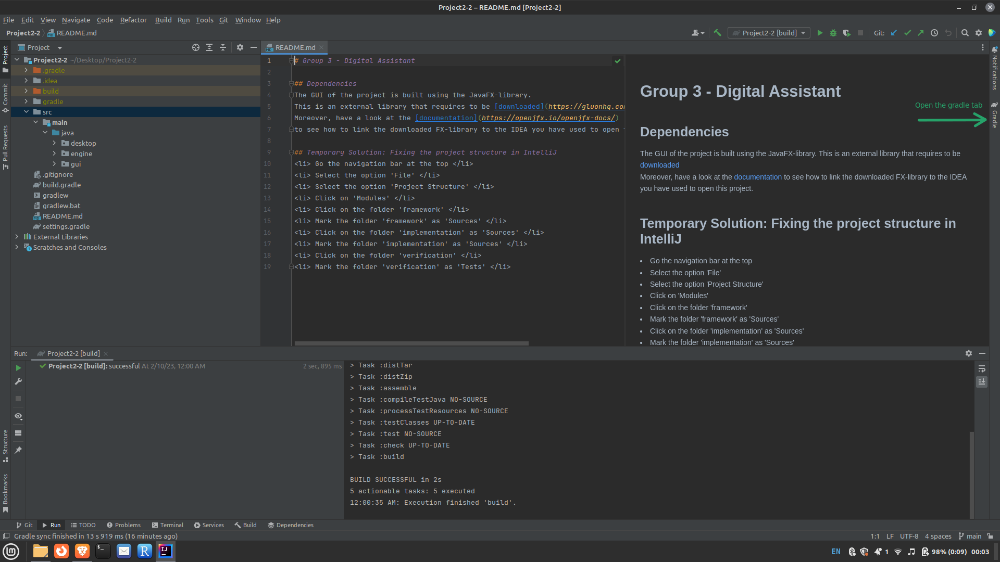
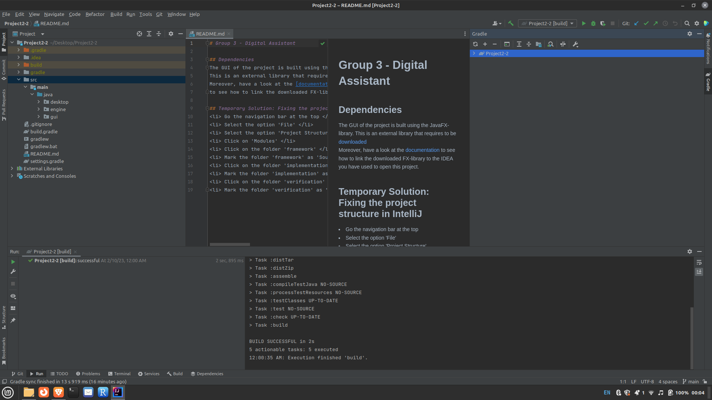
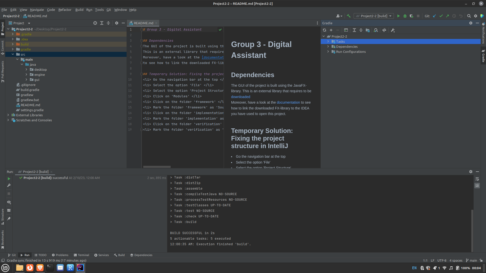
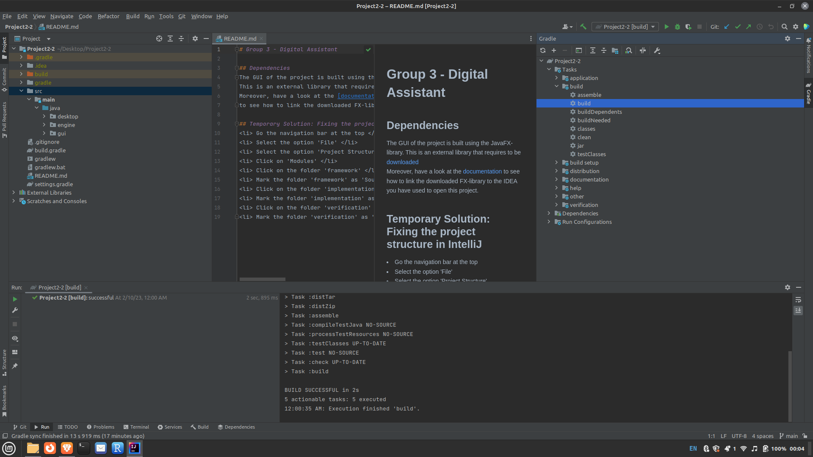
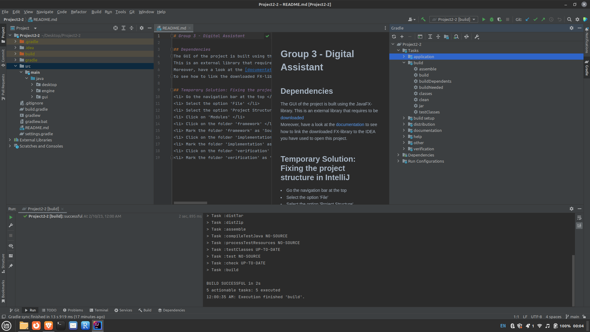
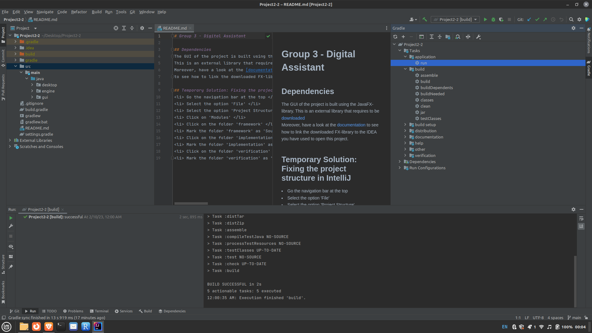

# Group 3 - Digital Assistant

## Running the GUI in IntelliJ using Gradle
1. Open the gradle tab that is located on the right side menu 
2. Open the dropdown menu by clicking once 
3. Open the next dropdown menu by clicking on 'Tasks' 
4. Open the one last dropdown menu by clicking on 'build' 
5. Double-click on the other 'build' to compile the project 
6. Open the last dropdown menu by clicking on 'application' 
7. Finally, double-click on 'run' and the GUI will be activated 

### Remark: GUI Location
To see what is running on the GUI or to add some new interactions etc.,
one can find the GUI (definition) in src/java/desktop/MainApp